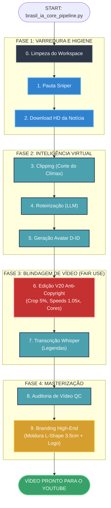

# 🏭 Arquitetura BrasilAI: Core Pipeline V13

Abaixo está a representação oficial em Diagrama (Mermaid) de toda a nossa lógica de orquestração industrial, desde a Caça à Notícia até a Aplicação da Borda e Proteção Anti-Copyright.

