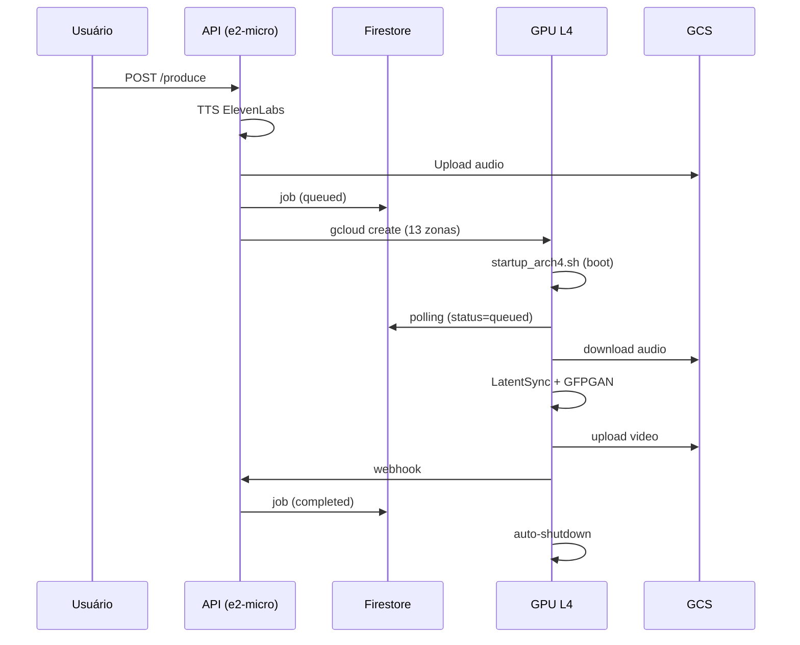

# Infraestrutura — Brasil AI Avatar v3.2.1

A infraestrutura segue o princípio **Zero-Waste**: GPUs nascem e morrem sob demanda.

## API (VM e2-micro)

- **Host:** `lana-api` (us-east1-c, IP fixo `35.231.46.76`)
- **Deploy:** Cloud Build → Artifact Registry → Deploy manual via sudo lana-update.sh (sem cron)
- **Boot:** `infra/boot/startup-e2-micro.sh` (Docker + systemd unit)
- **Endpoints:** POST /produce, GET /status/{job_id}, GET /health, POST /webhook/render-complete

## GPU L4 (Compute Engine)

- **Hardware:** `g2-standard-12` (48GB RAM, NVIDIA L4 24GB VRAM)
- **Imagem:** `avatar-l4:v2.10-golden` (CUDA 12.1, PyTorch 2.5.1, LatentSync, GFPGAN)
- **Boot:** `infra/boot/startup_arch4.sh` → Docker + NVIDIA Toolkit → GCS Fuse → pull golden image → docker cp código → container
- **Shutdown:** Sentinel HOST (systemd) + Dead Man Switch (90 min)

## Ciclo de Vida

