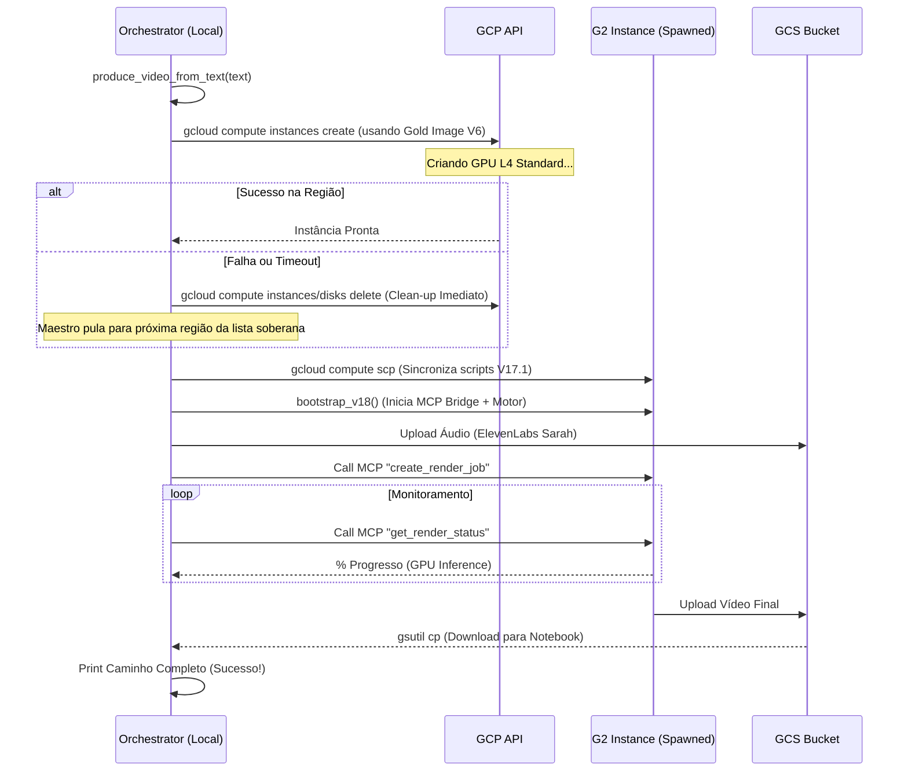

# 🏗️ Fluxo de Criação de Infraestrutura (V17.1)

A infraestrutura do projeto Lana é **dinâmica e orientada a eventos**, seguindo o princípio **Zero-Waste** (pague apenas pelos minutos de renderização).

O arquivo mestre responsável por toda a criação, gestão e destruição da infraestrutura é o:
📄 [agente_lana_orchestrator.py](file:///c:/Users/vinic/workspace_antigravity/Avatar/src/agente_lana_orchestrator.py)

## 🔄 Ciclo de Vida da Infraestrutura

## 🛠️ Detalhes do arquivo `agente_lana_orchestrator.py`

| Método | Função | Comando Principal |
| :--- | :--- | :--- |
| `ensure_instance_ready` | Maestro de Failover | Tenta spawnar em múltiplas zonas até obter GPU. |
| `_create_from_gold` | **O Criador** | `gcloud compute instances create ... --image GOLD_IMAGE` |
| `bootstrap_v18` | Provisionamento | Sincroniza `lipsync_pipeline.py` e inicia o `lana_mcp_server.py`. |
| `call_mcp_tool` | Ponte de Comando | Usa IAP Tunneling para enviar comandos sem abrir portas (Security First). |

---
> [!IMPORTANT]
> **Protocolo de Limpeza Transregional:**
> Sempre que o orquestrador pular de uma região para outra devido a erro de provisão ou timeout, ele DEVE disparar uma rotina de limpeza para remover qualquer disco ou instância remanescente na região anterior, garantindo o estado **Zero-Waste** global.

> [!NOTE]
> Toda a inteligência de "Auto-Cura" e "Failover de Zona" reside na classe `LanaIndustrialEngine` dentro deste arquivo. Se uma zona (ex: `us-central1-a`) estiver sem estoque de GPUs, o orquestrador pula automaticamente para a próxima zona da lista soberana.
