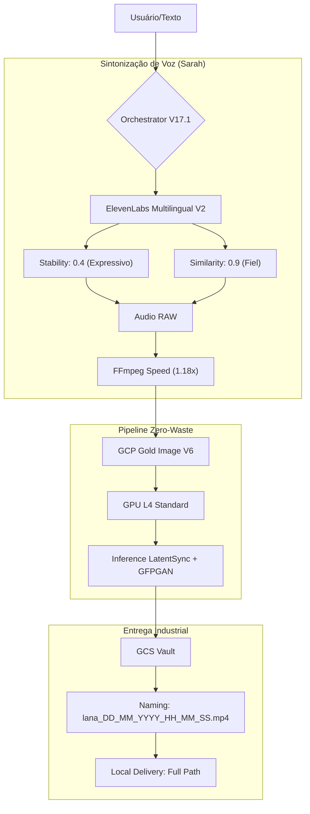

# 🎭 Orchestrator V17.1: Industrial Tuning

O **Orchestrator V17.1** é a versão de produção refinada do motor de avatares. Ele foca em dois pilares fundamentais: **Realismo Vocal** e **Rastreabilidade Industrial**.

## 🏗️ Arquitetura Visual (V17.1)

## 💎 O que mudou no V17.1?

### 1. Sintonização da Sarah (Voice Tuning)
*   **Problema:** A voz era percebida como "lenta e artificial".
*   **Solução:**
    *   **Velocidade:** Aceleração via hardware de `1.12x` para **`1.18x`**, removendo o tom arrastado.
    *   **Humanidade:** Redução da `estabilidade` para permitir maior variação tonal (mais humana) e aumento do `boost de similaridade` para capturar a essência da Sarah.

### 2. Nomenclatura Timestamped
*   **Problema:** Dificuldade em organizar múltiplos arquivos `final_job.mp4`.
*   **Solução:** Cada arquivo agora é único e rastreável no tempo.
    *   *Exemplo:* `lana_22_04_2026_06_41_00_8953ee.mp4`

### 3. Entrega Local de Alta Visibilidade
*   O pipeline agora injeta no console o caminho absoluto exato, facilitando o acesso imediato do usuário ao arquivo no Windows Explorer.

---
> [!TIP]
> Esta versão é a mais estável e performática até o momento, projetada para escala industrial sem falhas de cache ou disco.
