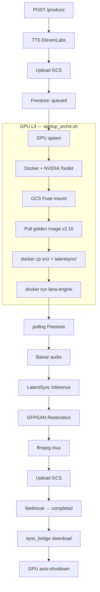

# Orquestrador — Brasil AI Avatar v3.2.1

## Fluxo de Renderização

## Parâmetros de Render (v3.2.1)

| Parâmetro | Valor |
|---|---|
| Whisper | small.pt + projeção 768→384 |
| Guidance | 2.5 |
| Steps | 20 |
| DeepCache | ON |
| Voz | Matilda (XrExE9yKIg1WjnnlVkGX) |
| Template | lana_comentario.mp4 |
| GFPGAN | ON |

## Shutdown

| Camada | Tempo | Onde roda |
|---|---|---|
| Sentinel HOST (idle GPU) | 30 min | systemd na VM |
| Sentinel HOST (container morto) | 30 min | systemd na VM |
| Dead Man Switch | 90 min | `at` command |
